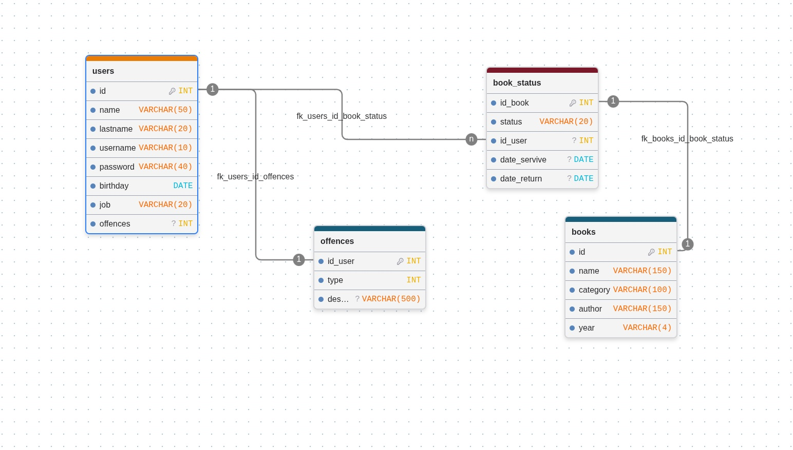

# BookWorm 🐛📖
A CLI python library manager

## Installation
(You need **python** and **pip** installed)
```bash
# Create a local enviroment for the installation
$ python -m venv .venv

# Activate the enviroment
$ source .venv/bin/activate

# Then install python libraries with pip
$ pip install -r requirements.txt

# And use it executing the main.py
$ python main.py
```
Or use it online (you gotta be logged) -> <br>
[](https://github.com/codespaces/new?repo=tteletubie/bookworm/)

## Database Schema:


### Team members:
1. Lesly Adilene Terrazo Rodriguez
2. Luis Gael Gonzalez Torres :star:
3. Grecia Carolina Silva Cortes
4. Maria Fernanda Obregon Ramirez
